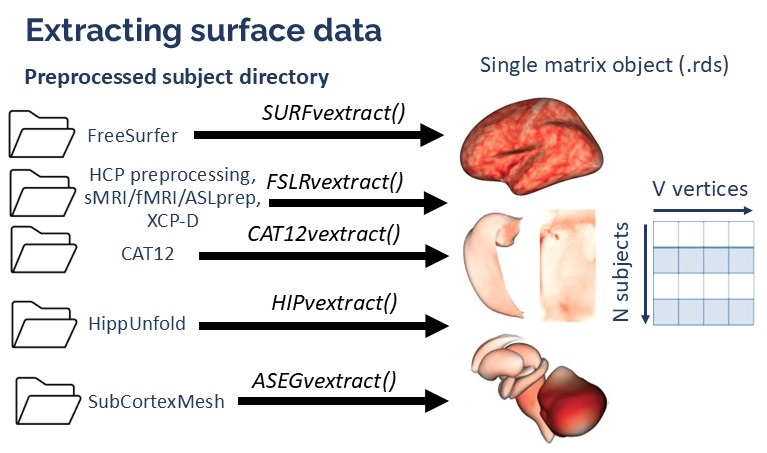

# Extracting surface data in VertexWiseR

## Summary

- [Extracting cortical surface data: from FreeSurfer](#id1)
- [Extracting cortical surface data: from HCP processing, sMRIprep,
  fMRIprep, ASLprep or XCP-D](#id2)
- [Extracting cortical surface data: from CAT12](#id3)
- [Extracting hippocampal surface data: from HippUnfold](#id4)
- [Extracting subcortical surface data: from SubCortexMesh](#id5)

------------------------------------------------------------------------

Surface extraction consists in reading through a preprocessing
pipeline’s subjects directory, collating the surface data (for a chosen
vertex-wise measure, e.g. thickness), and summarising it into one
compact matrix R object, with N rows per subject and M columns per
vertex values.



Surface extraction methods workflow

The functions save such objects as a .rds file. The file contains the R
surface matrix and, with the default subj_ID setting, an appended list
of the corresponding subjects ID. This file can be shared across any
device with R and all VertexWiseR statistical analyses functions can be
run on these, without the need to access the initially preprocessed
data.

As of version 1.5.0, 6 functions in VertexWiseR do surface data
extraction and synthesis:

- [SURFvextract()](https://cogbrainhealthlab.github.io/VertexWiseR/reference/SURFvextract.html)
- [FSLRvextract()](https://cogbrainhealthlab.github.io/VertexWiseR/reference/FSLRvextract.html)
- [CAT12vextract()](https://cogbrainhealthlab.github.io/VertexWiseR/reference/CAT12vextract.html)
- [DTSERIESvextract](https://cogbrainhealthlab.github.io/VertexWiseR/reference/DTSERIESvextract.html)
- [HIPvextract()](https://cogbrainhealthlab.github.io/VertexWiseR/reference/HIPvextract.html)
- [ASEGvextract()](https://cogbrainhealthlab.github.io/VertexWiseR/reference/ASEGvextract.html)

The demo data (~216 MB) required to run the surface extraction demos can
be downloaded from the package’s github repository with the following
function:

``` r
#This will save the demo_data directory in a temporary directory (tempdir(), but you can change it to your own path)
demodata=VertexWiseR:::dl_demo(path=tempdir(), quiet=TRUE)
```

## Extracting cortical surface data: from FreeSurfer

SURFvextract() extracts cortical surface data from a preprocessed
FreeSurfer subjects directory (Fischl 2012).

The function makes use of internal FreeSurfer functions to resample
every participant’s individual surface to fsaverage5 or fsaverage6.
Therefore, it requires FreeSurfer to be installed and set in the
environment where R is run and cannot be automatically run here.

For demonstration, we provide a subsample of 2 participants from the
[SPRENG
dataset](https://openneuro.org/datasets/ds003592/versions/1.0.13)
(Spreng et al. 2022), after preprocessing their surface data using
FreeSurfer’s default recon-all pipeline. Certain files that were not
needed (volumes, surfaces, label files) were removed to minimise the
subsample’s size.

We give the following code as example:

``` r
SPRENG_CTv = SURFvextract(
  sdirpath = paste0(demodata,'/spreng_surf_data_freesurfer'), 
  filename = "SPRENG_CTv.rds",
  template='fsaverage5',
  measure = 'thickness',
  subj_ID = FALSE)
```

The following arguments can be used: - sdirpath: Path to the
preprocessed subjects directory (will be used to define the SUBJECTS_DIR
variable automatically). - filename: Name of the saved .rds output (can
include a specific path to it). - template: The surface template space
in which to extract the data, which can be ‘fsaverage5’ (default) or
‘fsaverage6’. - measure: The name of the surface-based measure of
interest computed [in
FreeSurfer](https://surfer.nmr.mgh.harvard.edu/fswiki/UserContributions/FAQ).
That includes cortical thickness (‘thickness’), surface curvature
(‘curv’), depth/height of vertex (‘sulc’), surface area (‘area’), and
‘volume’ (for freesurfer 7.4.1 or later). Default is ‘thickness’. -
subj_ID Whether to obtain a list object containing both subject ID and
data matrix instead of just the matrix (TRUE OR FALSE).

Here is an example of surface matrix object, extracted from FreeSurfer
preprocessing of the all site 1 participants:

``` r
SPRENG_CTv = readRDS(
  file = paste0(demodata,"/SPRENG_CTv_site1.rds"))
dim(SPRENG_CTv)
```

    ## [1]   238 20484

What dim(SPRENG_CTv) shows is that the matrix object contains the
surface values of 238 participants, each with 20484 thickness values
which correspond to the vertices of fsaverage5, both left-to-right
hemispheres.

When the subj_ID argument is set to TRUE, the object returned is not a
matrix on its own but a list containing both the matrix and an array
listing the subject IDs from the directory. In our example: \*
SPRENG_CTv\[\[1\]\] will be the list of subject IDs \*
SPRENG_CTv\[\[2\]\] will be the matrix object

## Extracting cortical surface data: from HCP processing, sMRIprep, fMRIprep, ASLprep or XCP-D

FSLRvextract() extracts cortical data in FSLR32k surface space from
Human Connectome Project (HCP) (Van Essen et al. 2013), sMRIprep
(Esteban et al. 2021) (and outputs derived from it such as fMRIprep
(Esteban et al. 2019) and ASLprep (Adebimpe et al. 2022)) preprocessing
output directories, as well as XCP-D (Mehta et al. 2024) postprocessing
output directories.

For demonstration, we provide a subsample of 2 participants from the
[SPRENG
dataset](https://openneuro.org/datasets/ds003592/versions/1.0.13)
(Spreng et al. 2022), after preprocessing their surface data using
fMRIprep. The latter outputs fslr32k surface data when using the
“–cifti-output” option (Esteban et al. 2019). Other anatomical files
were removed and only the dscalar.nii and associated json files were
preserved, to minimise its size.

FSLRvextract() gets the data from .dscalar.nii files associated with the
specified measure (e.g. thickness, curv), and can extract it as follows:

``` r
dat_fslr32k=FSLRvextract(
  sdirpath=paste0(demodata,"/spreng_surf_data/"),
  filename="dat_fslr32k.rds",
  dscalar="_space-fsLR_den-91k_thickness.dscalar.nii",
  subj_ID = FALSE,
  silent=FALSE)
```

    ## Checking for VertexWiseR system requirements ...

    ## Processing (1/2) sub-122/ses-1/anat/sub-122_ses-1_space-fsLR_den-91k_thickness.dscalar.nii ...

    ## Processing (2/2) sub-129/ses-1/anat/sub-129_ses-1_space-fsLR_den-91k_thickness.dscalar.nii ...

    ## Saving output as dat_fslr32k.rds

    ## done!

The following arguments can be used: - sdirpath: Path to the
preprocessed subjects directory. - filename: Name of the saved .rds
output (can include a specific path to it). - dscalar: Suffix of the
dscalar surface files. Because these files are named differently
depending on the preprocessing pipeline, the user needs to specify what
they are in the dataset. - subj_ID Whether to obtain a list object
containing both subject ID and data matrix instead of just the matrix
(TRUE OR FALSE). Default is TRUE. - silent: Whether to silence messages
from the process (TRUE or FALSE). Default is FALSE.

Accordingly, the dat_fslr32k matrix will contain 2 rows (for 2
participants) and 64,984 columns (the subject’s cortical thickness
values in every vertex of the fslr32k surface).

Additionally, the
[DTSERIESvextract()](https://cogbrainhealthlab.github.io/VertexWiseR/reference/DTSERIESvextract.html)
function can be used on an individual CIFTI dtseries.nii typically
outputted in the same space by the fmriprep pipeline, to get one
subject’s surface data across N time points.

## Extracting cortical surface data: from CAT12

CAT12vextract() was implemented in version 1.2.0 and can extract surface
preprocessed with the CAT12 (Gaser et al. 2024) surface based
morphometry pipeline. The function requires reticulate (Ushey, Allaire,
and Tang 2023) to run.

For demonstration, we provide again a subsample of 2 participants from
the [SPRENG
dataset](https://openneuro.org/datasets/ds003592/versions/1.0.13)
(Spreng et al. 2022), after preprocessing their surface data using
CAT12’s SBM pipeline (segmentation and resampling without smoothing),
and extracting different possible surface measures. Only the 32k mesh
.gii and .dat files were kept.

CAT12vextract() extracts surface data resampled to 32k meshes (with or
without smoothing) and can be used as in this example:

``` r
CATsurf=CAT12vextract(
  sdirpath=paste0(demodata,"/SPRENG_CAT12_subsample"),
  filename='CAT12_thickness.rds', 
  measure='thickness', 
  subj_ID = TRUE,
  silent = FALSE,
  VWR_check = FALSE)
```

    ## Non-interactive sessions need requirement checks

The following arguments can be used: - sdirpath: Path to the
preprocessed subjects directory (will be used to define the SUBJECTS_DIR
variable automatically). We recommend that the directory follows the
[BIDS](https://bids.neuroimaging.io/) structure for accuracy. -
filename: Name of the saved .rds output (can include a specific path to
it) - measure: The name of the surface-based measure of interest
computed [in CAT12](https://neuro-jena.github.io/cat12-help/#sbm). That
includes ‘thickness’, ‘depth’, ‘fractaldimension’, ‘gyrification’, and
‘toroGI20mm’. - subj_ID Whether to obtain a list object containing both
subject ID and data matrix instead of just the matrix (TRUE OR FALSE)

Accordingly, the matrix will contained 2 rows (for 2 participants) and
64,984 columns (the subject’s cortical thickness values in every vertex
of the 32k mesh):

``` r
#The surface object contains the surface matrix and the list of subjects ID (and session number if applicable)
names(CATsurf)
```

    ## NULL

``` r
#The surface matrix dimensions:
dim(CATsurf$surf_obj)
```

    ## NULL

## Extracting hippocampal surface data: from HippUnfold

HIPvextract() extracts cortical data in CITI168 surface space from the
HippUnfold preprocessing pipeline (DeKraker et al. 2023). As opposed to
the other two functions, HIPvextract() does not require any system
requirement.

For demonstration, we provide a subsample of 2 participants from the
[Fink dataset](https://openneuro.org/datasets/ds003799/versions/2.0.0)
(Fink et al. 2021), after preprocessing their surface data using
HippUnfold, keeping all output .gii files.

To extract and collate the data of the two participants, HIPvextract()
can be run as follows:

``` r
hipp_surf=HIPvextract(sdirpath=paste0(demodata,
                                      "/fink_surf_data"),
            filename="hippocampal_surf.rds",
            measure="thickness",
            subj_ID = TRUE) 
```

The following arguments can be used: - sdirpath: Path to the
preprocessed subjects directory. - filename: Name of the saved .rds
output (can include a specific path to it). - measure: The name of the
surface-based measure of interest computed [in
HippUnfold](https://hippunfold.readthedocs.io/en/latest/outputs/output_files.html#surface-metrics).
That includes ‘thickness’,‘curvature’,‘gyrification’ and ‘surfarea’.
Default is ‘thickness’. - subj_ID: Whether to obtain a list object
containing both subject ID and data matrix instead of just the matrix
(TRUE OR FALSE). Default is TRUE.

Note that when subjects directories have multiple sessions, the matrix
object will contain N rows per participant and per session.

``` r
hipp_surf[[1]]
```

    ## [1] "sub-season101_ses-1" "sub-season101_ses-2" "sub-season101_ses-3"
    ## [4] "sub-season102_ses-1" "sub-season102_ses-2" "sub-season102_ses-3"

Here the matrix has 6 rows for 2 particiants with 3 sessions each; and
14,524 columns (the hippocampal thickness values in every vertex of the
CITI168 surface).

``` r
dim(hipp_surf[[2]])
```

    ## [1]     6 14524

## Extracting subcortical surface data: from SubCortexMesh

ASEGvextract() extracts subcortical data based on FreeSurfer’s
volumetric ASeg subcortical segmentations, converted to surfaces via the
python pipeline from
[SubCortexMesh](https://github.com/chabld/SubCortexMesh). ASEGvextract()
does not require any system requirement, but further plotting and
modelling will require downloading associated template data (the package
will prompt you automatically or you may do it directly by typing
`VertexWiseR:::scm_database_check()`)

For demonstration, we provide a subsample of 2 participants from the
[SUDMEX_CONN](https://openneuro.org/datasets/ds003346/versions/1.1.2)
dataset (Garza-Villarreal et al. 2017), after computing their surface
data using SubCortexMesh, keeping all output .vtk files.

To extract and collate the data of the two participants:

``` r
aseg_CTv = ASEGvextract(
  sdirpath = paste0(demodata,'/sudmex_conn_surf_data_subcortexmesh/'), 
  outputdir = "subcortical_matrices",
  measure = 'thickness',
  roilabel= c('thalamus','caudate'),
  subj_ID = TRUE,
  silent= FALSE,
  VWR_check = FALSE)
```

    ## Non-interactive sessions need requirement checks

The following arguments can be used: - sdirpath: Path to the
surface_metrics output directory - filename: Name of the directory that
will contain each subcortical region’s .rds matrix (can include a
specific path to it) - measure: The name of the surface-based measure of
interest computed [in
SubCortexMesh](https://github.com/chabld/SubCortexMesh). That includes
‘thickness’,‘curvature’,‘surfarea’. Default is ‘thickness’. - roilabel:
One name or vector of names of the subcortical region(s) to extract.
This is optional, all subcortices will be included if the argument is
not provided. - subj_ID: For each separate subcortical matrix, whether
to obtain a list object containing both subject ID and data matrix
instead of just the matrix (TRUE OR FALSE). Default is TRUE. - silent:
Whether to silence messages from the process (TRUE or FALSE). Default is
FALSE.

As opposed to other extraction functions, multiple matrices (one for
each subcortical area, bilateral when applicable) are saved inside the
path indicated in “outputdir”, and returned together in a single list
object:

``` r
names(aseg_CTv)
```

    ## NULL

``` r
aseg_CTv[['caudate']]$sub_list
```

    ## NULL

``` r
dim(aseg_CTv[['caudate']]$surf_obj)
```

    ## NULL

``` r
dim(aseg_CTv[['thalamus']]$surf_obj)
```

    ## NULL

## References:

Adebimpe, Azeez, Maxwell Bertolero, Sudipto Dolui, Matthew Cieslak,
Kristin Murtha, Erica B Baller, Bradley Boeve, et al. 2022. “ASLPrep: A
Platform for Processing of Arterial Spin Labeled MRI and Quantification
of Regional Brain Perfusion.” *Nature Methods* 19 (6): 683–86.
<https://doi.org/10.1038/s41592-022-01458-7>.

DeKraker, Jordan, Nicola Palomero-Gallagher, Olga Kedo, Neda
Ladbon-Bernasconi, Sascha EA Muenzing, Markus Axer, Katrin Amunts, Ali R
Khan, Boris C Bernhardt, and Alan C Evans. 2023. “Evaluation of
Surface-Based Hippocampal Registration Using Ground-Truth Subfield
Definitions.” Edited by Anna C Schapiro and Laura L Colgin. *eLife* 12
(November): RP88404. <https://doi.org/10.7554/eLife.88404>.

Esteban, Oscar, Christopher J. Markiewicz, Ross W. Blair, Craig A.
Moodie, A. Ilkay Isik, Asier Erramuzpe, James D. Kent, et al. 2019.
“fMRIPrep: A Robust Preprocessing Pipeline for Functional MRI.” *Nature
Methods* 16 (1): 111–16. <https://doi.org/10.1038/s41592-018-0235-4>.

Esteban, Oscar, Christopher J Markiewicz, Ross Blair, Russell A
Poldrack, and Krzysztof J Gorgolewski. 2021. “sMRIPrep: Structural MRI
PREProcessing Workflows.” *Zenodo*.
<https://doi.org/10.5281/zenodo.2650521>.

Fink, Andreas, Karl Koschutnig, Thomas Zussner, Corinna M.
Perchtold-Stefan, Christian Rominger, Mathias Benedek, and Ilona
Papousek. 2021. “A Two-Week Running Intervention Reduces Symptoms
Related to Depression and Increases Hippocampal Volume in Young Adults.”
*Cortex* 144 (November): 70–81.
<https://doi.org/10.1016/j.cortex.2021.08.010>.

Fischl, Bruce. 2012. “FreeSurfer.” *NeuroImage* 62 (2): 774–81.
<https://doi.org/10.1016/j.neuroimage.2012.01.021>.

Garza-Villarreal, EA, MM Chakravarty, B Hansen, SF Eskildsen, GA
Devenyi, D Castillo-Padilla, T Balducci, et al. 2017. “The Effect of
Crack Cocaine Addiction and Age on the Microstructure and Morphology of
the Human Striatum and Thalamus Using Shape Analysis and Fast Diffusion
Kurtosis Imaging.” *Translational Psychiatry* 7 (5): e1122.
<https://doi.org/10.1038/tp.2017.92>.

Gaser, Christian, Robert Dahnke, Paul M Thompson, Florian Kurth, Eileen
Luders, and the Alzheimer’s Disease Neuroimaging Initiative. 2024. “CAT:
A Computational Anatomy Toolbox for the Analysis of Structural MRI
Data.” *GigaScience* 13 (January): giae049.
<https://doi.org/10.1093/gigascience/giae049>.

Mehta, Kahini, Taylor Salo, Thomas J Madison, Azeez Adebimpe, Danielle S
Bassett, Max Bertolero, Matthew Cieslak, et al. 2024. “XCP-d: A Robust
Pipeline for the Post-Processing of fMRI Data.” *Imaging Neuroscience*
2: 1–26. <https://doi.org/10.1162/imag_a_00257>.

Spreng, R. Nathan, Roni Setton, Udi Alter, Benjamin N. Cassidy, Bri
Darboh, Elizabeth DuPre, Karin Kantarovich, et al. 2022. “Neurocognitive
Aging Data Release with Behavioral, Structural and Multi-Echo Functional
MRI Measures.” *Scientific Data* 9 (1): 119.
<https://doi.org/10.1038/s41597-022-01231-7>.

Ushey, K, J Allaire, and Y Tang. 2023. “Reticulate: Interface to
’Python’.” <https://CRAN.R-project.org/package=reticulate>.

Van Essen, David C., Stephen M. Smith, Deanna M. Barch, Timothy E. J.
Behrens, Essa Yacoub, and Kamil Ugurbil. 2013. “The WU-Minn Human
Connectome Project: An Overview.” *NeuroImage* 80 (October): 62–79.
<https://doi.org/10.1016/j.neuroimage.2013.05.041>.
