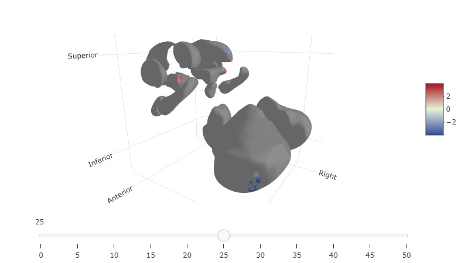

---

```{r setup, include=FALSE}
knitr::opts_chunk$set(warning = FALSE, message = FALSE, dpi = 80, fig.path = tempdir())
library(VertexWiseR)
```

This article introduces vertex-wise statistical modelling of subcortical surfaces as per update v1.5.0. The subcortical surfaces it is currently compatible with are based on the "ASeg" (Automated subcortical segmentation) parcellation computed in FreeSurfer [@fischl_freesurfer_2012]. The latter volumes are converted to 3D meshes and surface-based metrics (thickness, surface area, curvature) produced using the python module [SubCortexMesh](https://github.com/chabld/SubCortexMesh). VertexWiseR can extract the measures obtained with the latter package.

## Requirements

Analysis and manipulation of the subcortical surfaces require additional utility data (\~19.9 MB) to be downloaded and stored in the R package's external data (`system.file('extdata',package='VertexWiseR')`). A prompt will automatically be triggered to assist downloading it whenever subcortical surfaces are inputted (users can trigger it themselves by typing `VertexWiseR:::aseg_database_check()`).

## Extracting ASeg subcortical surfaces

SubCortexMesh's surface metric output in template space can be extracted by VertexWiseR as in the other [surface extraction functions](https://cogbrainhealthlab.github.io/VertexWiseR/articles/VertexWiseR_surface_extraction.html), generating compact (bilateral) matrices for all applicable subcortical surfaces. Here is an example of code which was run to obtain the demo data:

```{r, eval=FALSE}
aseg_CTv = ASEGvextract(sdirpath = 'surface_metrics/', outputdir = "aseg_matrices/",measure = 'thickness', roilabel = c('thalamus','caudate'), subj_ID = TRUE)
```

## Example analysis on the thalamus and caudate nuclei

The analysis will use surface data already extracted in R from a preprocessed subjects directory, which we make available so you do not need to preprocess a sample yourself. To obtain it, we had thickness and curvature metrics data from a SubCortexMesh processing directory of the SUDMEX_CONN dataset [@PMID:28485734].

The demo data (\~216 MB) can be downloaded from the package's github repository with the following function:

```{r, eval=TRUE}
#This will save the demo_data directory in a temporary directory (tempdir(), but you can change it to your own path)
demodata=VertexWiseR:::dl_demo(path=tempdir(), quiet=TRUE)
```

As in the ASEGvextract() code above, metrics from the bilateral thalami and caudate nuclei were extracted. The surface data can be loaded that way:

```{r}
thalamus_thickness = readRDS(file=paste0(demodata,"/SUDMEX_CONN_thalamus_thickness.rds"))
thalamus_curvature = readRDS(file=paste0(demodata,"/SUDMEX_CONN_thalamus_curvature.rds"))

caudate_thickness = readRDS(file=paste0(demodata,"/SUDMEX_CONN_caudate_thickness.rds"))
caudate_curvature = readRDS(file=paste0(demodata,"/SUDMEX_CONN_caudate_curvature.rds"))
```

To load the corresponding behavioural data (all subjects indiscriminately):

```{r}
beh_data = readRDS(paste0(demodata,"/SUDMEX_CONN_behdata.rds"))
```

Here, we are interested in the effect of group (cocaine use disorder (CUD) versus control) on the thalami and caudate nuclei (replicating a similar analysis that was done by [@xu2023cocaine]). We can run a vertex-wise analysis model with random field theory-based cluster correction, testing for the effect of group on each region and each metric:

```{r, results = 'hide'}
for (surf_data in c('thalamus_thickness', 'thalamus_curvature',
                    'caudate_thickness', 'caudate_curvature'))
{   
model=RFT_vertex_analysis(model = as.factor(beh_data$group),
                          contrast = as.factor(beh_data$group),
                          surf_data = get(surf_data))
assign(paste0('model_',surf_data),model)
}
```

```{r}
model_thalamus_thickness$cluster_level_results
model_thalamus_curvature$cluster_level_results
model_caudate_thickness$cluster_level_results
model_caudate_curvature$cluster_level_results
```

We can plot them together in one summary plot by binding the maps:

```{r, results = 'hide'}
thalamusmaps=rbind(model_thalamus_thickness$thresholded_tstat_map,
                  model_thalamus_curvature$thresholded_tstat_map)

caudatemaps= rbind(model_caudate_thickness$thresholded_tstat_map,
              model_caudate_curvature$thresholded_tstat_map)

```

```{r, echo=TRUE, fig.align="center", out.width="100%", fig.alt="Significant clusters after RFT correction on the thalamus and caudate",fig.width=10, fig.height=7}
plot_surf(thalamusmaps, 
          filename='SUDMEX_CONN_thalamus_tstatmaps.png',
          title=c('Thickness','Curvature'),
          smooth_mesh=20,
          show.plot.window=TRUE,
          VWR_check = FALSE)
plot_surf(caudatemaps, 
          filename='SUDMEX_CONN_caudate_tstatmaps.png',
          title=c('Thickness','Curvature'), 
          smooth_mesh=20,
          show.plot.window=TRUE,
          VWR_check = FALSE)
```


The outcome shows that compared to controls, CUD patients had decreases in thickness of the bilateral thalami, and various shapes alterations in curvature.

## Analysing all subcortices together

SubCortexMesh has a function to merge all subcortices, assuming all of them are available, into one single object for each metric. For example, the "allaseg" can be outputted in SubCortexMesh's surface_metrics/ directory, and extracted via ASEGvextract():

```{r, eval=FALSE}
allaseg_thickness_data = ASEGvextract(sdirpath = 'surface_metrics/', outputdir = "sudmex_conn_surf_data_scm/", measure = 'thickness', roilabel = 'allaseg', subj_ID = TRUE)
```

As an example, we provide the "allaseg" thickness for the same dataset and run the same analysis:

```{r, results = 'hide'}
allaseg_thickness = readRDS(file=paste0(demodata,"/SUDMEX_CONN_allaseg_thickness.rds"))
allaseg_model=RFT_vertex_analysis(
  model = as.factor(beh_data$group),
  contrast = as.factor(beh_data$group),
  surf_data = allaseg_thickness)
```

```{r}
allaseg_model$cluster_level_results
```

We can plot the subcortices together the same way:

```{r, results = 'hide',  fig.align="center", out.width="100%", fig.alt="Significant clusters after RFT correction across all ASeg  subcortices, 2D plot", fig.width=10, fig.height=2}
allasegplot=plot_surf(
  surf_data=allaseg_model$thresholded_tstat_map,
  filename='SUDMEX_CONN_allaseg_tstatmaps.png',
  title='Thickness',
  smooth_mesh=20,
  show.plot.window=TRUE)
```

Since some regions may be harder to see in the 2d plot, plot_surf3d() function has a special interactive slider in the GUI that allows spacing out each regions from each other (this only applies to the merged surfaces):

```{r, eval=FALSE}
plot_surf3d(surf_data = allaseg_model$thresholded_tstat_map,
            surf_color = 'grey', smooth_mesh = 50)
```

```{r, echo=FALSE, fig.align="center", out.width="100%", fig.alt="Significant clusters after RFT correction across all ASeg  subcortices, 3D plot (screenshot)"}

```
(This is just a screenshot)

Although SubCortexMesh requires that all regions be processed for the encompassing surface to be created, it is possible to omit specific regions from the analysis by turning to NA their corresponding vertices. 

Users can identify the exact vertex indices in the python module's template_data. Here is the table that applies for ASeg:

|     |                         |        |              |
|-----|-------------------------|--------|--------------|
| id  | label                   | n_vert | n_vert_cumul |
| 0   | right-caudate           | 3500   | 3500         |
| 1   | right-putamen           | 4126   | 7626         |
| 2   | left-accumbens-area     | 1022   | 8648         |
| 3   | right-amygdala          | 1792   | 10440        |
| 4   | right-pallidum          | 1600   | 12040        |
| 5   | left-putamen            | 4268   | 16308        |
| 6   | right-ventraldc         | 3594   | 19902        |
| 7   | left-caudate            | 3440   | 23342        |
| 8   | left-pallidum           | 1600   | 24942        |
| 9   | left-amygdala           | 1638   | 26580        |
| 10  | left-hippocampus        | 4046   | 30626        |
| 11  | left-thalamus           | 3936   | 34562        |
| 12  | brain-stem              | 9452   | 44014        |
| 13  | left-ventraldc          | 3550   | 47564        |
| 14  | left-cerebellum-cortex  | 19550  | 67114        |
| 15  | right-accumbens-area    | 1022   | 68136        |
| 16  | right-thalamus          | 3832   | 71968        |
| 17  | right-cerebellum-cortex | 19664  | 91632        |
| 18  | right-hippocampus       | 4086   | 95718        |

So, for example, if one does not want to count the cerebella in the analysis, they can follow the cumulative vertex count and set them to NA, like that:
```{r, results = 'hide'}
allaseg_thickness$surf_obj[,c((47564+1):67114,(71968+1):91632)]=NA

allaseg_model_nocerebellum=RFT_vertex_analysis(
  model = as.factor(beh_data$group),
  contrast = as.factor(beh_data$group),
  surf_data = allaseg_thickness)
```
```{r}
allaseg_model_nocerebellum$cluster_level_results
```

```{r, echo=FALSE}
#to clean up images written:
unlink('SUDMEX_CONN_thalamus_tstatmaps.png')
unlink('SUDMEX_CONN_caudate_tstatmaps.png')
unlink('SUDMEX_CONN_allaseg_tstatmaps.png')
```

## References:
