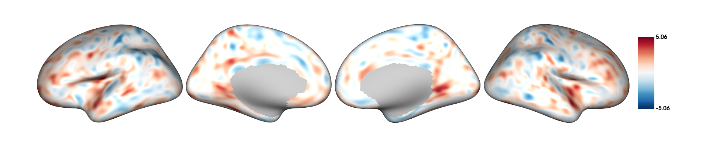
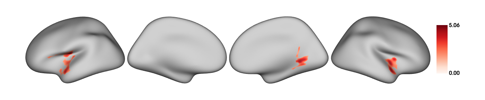
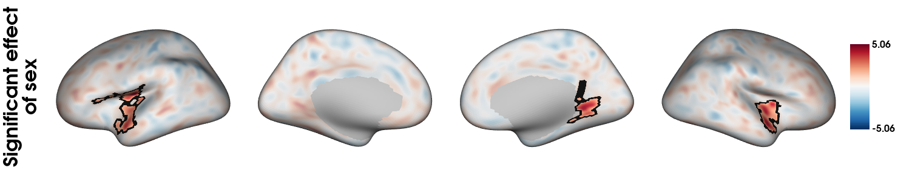
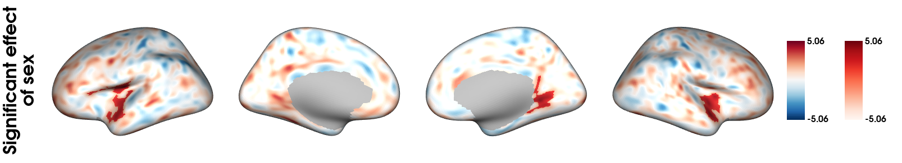
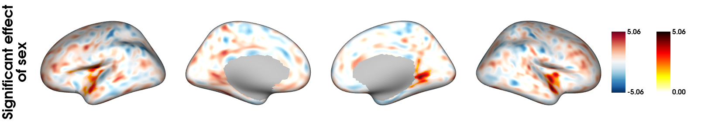
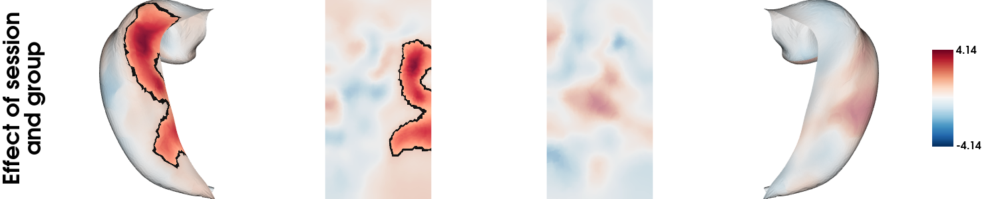

```{r setup, include=FALSE}
knitr::opts_chunk$set(warning = FALSE, message = FALSE) 
library(VertexWiseR)
```

## Transparent thresholding

This article presents the plot_overlay_surf() function which can be used to overlay plots similar to those produced with surf_plot() in VertexWiseR. We show how we can use the function to apply "transparent thresholding", which consists in reporting spatial neuroimaging results at a lower, non-significant subthreshold, to contextualise significant findings and improve broader interpretation across studies [@taylor2025go].

The demo data (218 MB) required to run the package demos can be downloaded from the package's github repository with the following function:

```{r, eval=TRUE}
#This will save the demo_data directory in a temporary directory (tempdir(), but you can change it to your own path)
demodata=VertexWiseR:::dl_demo(path=tempdir(), quiet=TRUE)
```

## Running a vertex-wise linear model

In this example, we use the Spreng dataset cortical thickness and behavioural data as in [Example 1](https://cogbrainhealthlab.github.io/VertexWiseR/articles/VertexWiseR_Example_1.html) and the [home example](https://cogbrainhealthlab.github.io/VertexWiseR/index.html) , selecting young adults:

```{r, eval=TRUE}
SPRENG_CTv = readRDS(file=paste0(demodata,"/SPRENG_CTv_site1.rds"))
dat_beh = readRDS(paste0(demodata,'/SPRENG_behdata_site1.rds'))
#only young adults
SPRENG_CTv = SPRENG_CTv[dat_beh$agegroup=='Y',]
dat_beh = dat_beh[dat_beh$agegroup=='Y',]
#smoothing at 10 FMHW
SPRENG_CTv_smoothed = smooth_surf(SPRENG_CTv, 10, VWR_check = T)
```

We test the effect of sex on cortical thickness in the sample:

```{r, eval=TRUE}
#preparing model data
predictors=dat_beh[,c("site","age","sex")]
#running the model
results=RFT_vertex_analysis(model=predictors, 
                            contrast=predictors$sex, 
                            surf_data = SPRENG_CTv_smoothed,
                            p = 0.05 
                            )
results$cluster_level_results
```

According to these results, since females are coded as 0 and males as 1, the regions colored in red are thicker in males.

## Plotting significant and subthreshold outcome

Both RFT_vertex_analysis() and TFCE_threshold() return thresholded and unthresholded t-maps, and can be plotted individually as follows.

Unthresholded t-map:

```{r, eval=TRUE, results = 'hide'}
plot_surf(surf_data = results$tstat_map,
          filename = "sexdiff_nothresh.png",
          size=c(1400,291),
          show.plot.window=FALSE)
```

```{r, eval=TRUE, echo=FALSE, fig.align="center", out.width="100%", fig.alt="Unthresholded t-statistic map"}

```

Thresholded (significant) t-map:

```{r, eval=TRUE, results = 'hide'}
plot_surf(surf_data = results$thresholded_tstat_map,
          filename = "sexdiff_thresh.png",
          size=c(1400,291),
          show.plot.window=FALSE)
```

```{r, echo=FALSE, fig.align="center", out.width="100%", fig.alt="Significant clusters after RFT correction"}

```

## Overlaying plots together

To apply transparency thresholding, and letting information about subthreshold effects present in the plot, one may want to "merge" both maps together. plot_overlay() is a function that will allow you to plot an overlay surface (surf_data_2) on top of a background (surf_data_1).

To work in this context, we plot a thresholded (significant) t-stat map on top of an unthresholded t-stat map, both of which can be automatically taken from the 'results' variable saved from the RFT_vertex_analysis() model.

We reduce the alpha opacity of the background surface to highlight the surface on top:

```{r, eval=TRUE, results = 'hide'}
plot_overlay_surf(model_output=results,
                  #To specify maps manually:
                  #surf_data_1=results$tstat_map,
                  #surf_data_2=results$thresholded_tstat_map, 
                  cmap_1='RdBu_r', cmap_2='RdBu_r',
                  colorbar_1=FALSE, colorbar_2=TRUE,
                  alpha_1=0.4, alpha_2=1,
                  overlay_boundaries=TRUE,
                  limits_2='same',
                  filename='overlay_plot.png',
                  size=c(1400,291), 
                  title="Significant effect\nof sex",
                  show.plot.window=FALSE)
```

```{r, eval=TRUE, echo=FALSE, fig.align="center", out.width="100%", fig.alt="Significant vertices on top of transparent t map"}

```

By default, both color bars are plotted but either can be set to FALSE (removed), which was done for the faded background colours here.

The function also give freedom to have two separate color maps, in order to highlight the significant t-values even more:

```{r, eval=TRUE, results = 'hide'}
plot_overlay_surf(model_output=results, 
                  cmap_1='RdBu_r', cmap_2='Reds',
                  alpha_1=1, alpha_2=1,
                  limits_2='same',
                  filename='overlay_plot_twocmaps.png',
                  size=c(1400,291), 
                  title="Significant effect\nof sex",
                  show.plot.window=FALSE)
```

```{r, echo=FALSE, fig.align="center", out.width="100%", fig.alt="Significant vertices on top of transparent t map, with different color maps"}

```

A similar procedure can be used if one wants the range of values to be independent (which is the default if the limits=='same' option is not provided):

```{r, eval=TRUE, results = 'hide'}
plot_overlay_surf(model_output=results, 
                  cmap_1='RdBu_r', cmap_2='hot_r',
                  alpha_1=1, alpha_2=1,
                  filename='overlay_plot_twolimits.png',
                  size=c(1400,291),
                  title="Significant effect\nof sex",
                  show.plot.window=FALSE)
```

```{r, echo=FALSE, fig.align="center", out.width="100%", fig.alt="Significant vertices on top of transparent t map, with different color maps and different ranges"}

```

## Overlaying hippocampal plots

The same can be applied to HippUnfold hippocampal surfaces. We reproduce the results from the first analysis in [Example 2](https://cogbrainhealthlab.github.io/VertexWiseR/articles/VertexWiseR_Example_2.html):

```{r, eval=TRUE, results = 'hide'}
FINK_Tv_ses13 = readRDS(file=paste0(demodata,"/FINK_Tv_ses13.rds"))
dat_beh_ses13 = readRDS(paste0(demodata,"/FINK_behdata_ses13.rds"))
model2_RFT=RFT_vertex_analysis(
  model = dat_beh_ses13[,c("session","group","session_x_group")],
  contrast = dat_beh_ses13[,"session_x_group"],
  surf_data=FINK_Tv_ses13,
  random=dat_beh_ses13[,"participant_id"], 
  smooth_FWHM = 5,
  p=0.05)
```

Plotted in the same manner:

```{r, eval=TRUE, results = 'hide'}
plot_overlay_surf(model_output=model2_RFT, 
                  cmap_1='RdBu_r', cmap_2='RdBu_r',
                  colorbar_1=FALSE, colorbar_2=TRUE,
                  alpha_1=0.4, alpha_2=1,
                  limits_2='same',
                  filename='overlay_plot_hippocampus.png',
                  overlay_boundaries=TRUE,
                  size=c(1400,300),
                  title="Effect of session\nand group",
                  show.plot.window=FALSE)
```

```{r, echo=FALSE, fig.align="center", out.width="100%", fig.alt="Significant vertices on top of transparent t map, with different color maps and different ranges"}

```

## References:
